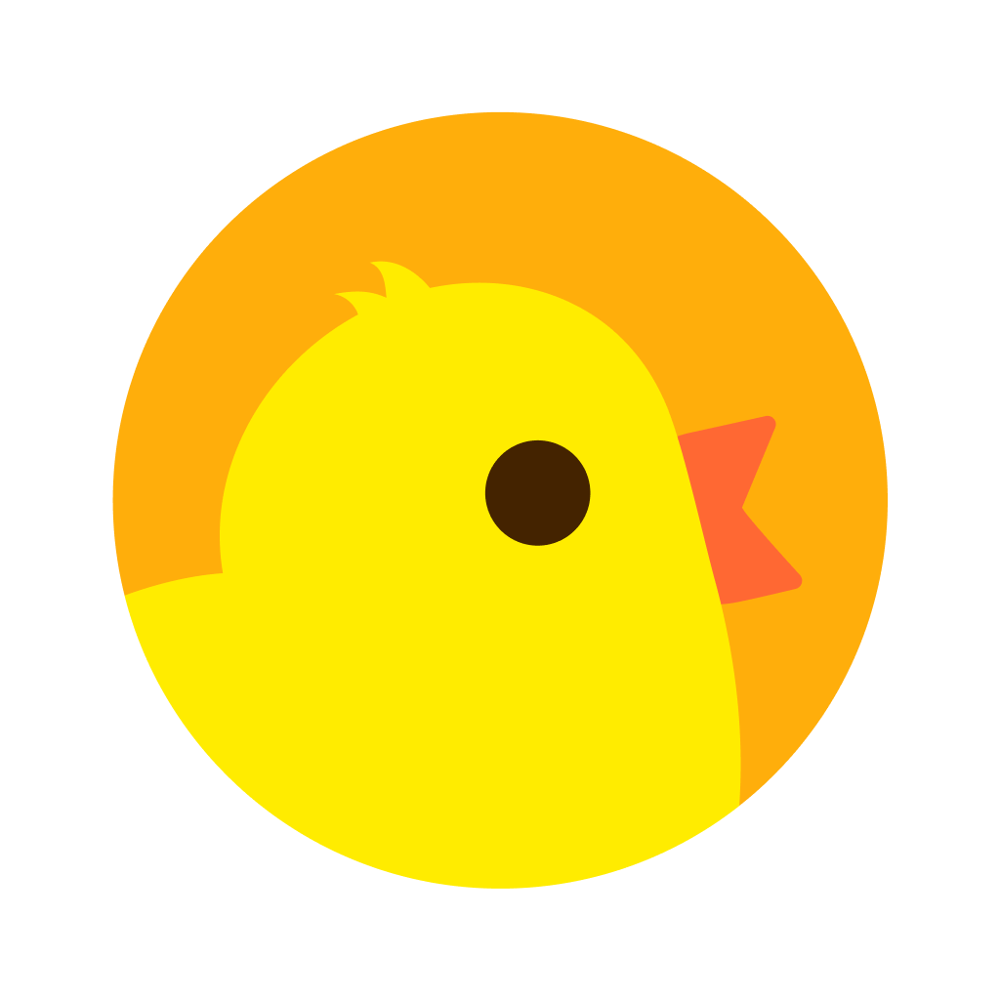
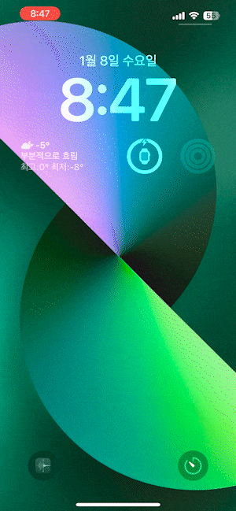

<h1 align="center">
  CHEEK!
</h1>

  
   
   
  재직자, 취업준비생을 위한 직무 Q&A 플랫폼 CHEEK!
   
  빠르게 변화하는 취업 시장 속, CHEEK!은 취업준비생과 재직자 모두를 위한 무료 직무 커뮤니티입니다.
   
  간편하고 흥미로운 UI를 통해 자유롭게 질문과 답변을 주고 받으며 커리어 여정을 시작하세요!

 

  
   
  (서버 운영 문제로 인하여 서비스 종료)

## 소개

CHEEK!은 유쾌하고 즐거운 분위기 속에서 직무에 관한 질문과 답변을 주고받을 수 있는 커리어 Q&A 플랫폼입니다. 
다양한 리액티브 기능을 도입하여 기존 직무 관련 플랫폼들의 단점을 보완하고, 사용자는 현직자(<ins>멘토</ins> 회원)와 취업준비생(<ins>멘티</ins> 회원) 모두가 자유롭게 정보를 공유하고 상호작용할 수 있습니다! 
사용자들은 손쉽게 직무 관련 조언을 얻을 수 있으며, 자신의 경험과 지식을 나눌 수 있습니다!
 
 

## 기능

<table>
  <tr>
    <td align="center">
      
    </td>
  </tr>
  <tr>
    <td align="center"><b>질문</b> (멘토, 멘티)</td>
  </tr>
</table>

<table>
  <tr>
    <td align="center">
      
    </td>
  </tr>
  <tr>
    <td align="center"><b>스토리 답변</b> (멘토)</td>
  </tr>
</table>

<table>
  <tr>
    <td align="center">
      
    </td>
  </tr>
  <tr>
    <td align="center"><b>스크랩</b> (멘토, 멘티)</td>
  </tr>
</table>

<table>
  <tr>
    <td align="center">
      
    </td>
  </tr>
  <tr>
    <td align="center"><b>하이라이트</b> (멘토)</td>
  </tr>
</table>

<table>
  <tr>
    <td align="center">
      
    </td>
  </tr>
  <tr>
    <td align="center"><b>푸시 알림</b></td>
  </tr>
</table>

## 팀원

<table>
  <tr>
    <td align="center">
      
    </td>
    <td align="center">
      
    </td>
    <td align="center">
      
    </td>
  </tr>
  <tr>
    <td align="center">
      <b>팀장 / 기획</b>
       
      <a href="https://github.com/imzzok">imzzok</a>
    </td>
    <td align="center">
      <b>iOS</b>
       
      <a href="https://github.com/hugesilver">hugesilver</a>
    </td>
    <td align="center">
      <b>백엔드</b>
       
      <a href="https://github.com/sejyom">sejyom</a>
    </td>
  </tr>
</table>

## 기술 스택

   

## 외부 패키지

- [Firebase](https://github.com/firebase/firebase-ios-sdk)
- [KakaoOpenSDK](https://github.com/kakao/kakao-ios-sdk-rx)
- [Kingfisher](https://github.com/onevcat/Kingfisher)
- [WrappingHStack](https://github.com/dkk/WrappingHStack)
